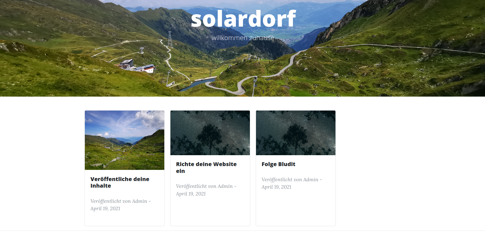

# Clean Blog Cards theme for Bludit
Clean blog Cards is a carefully styled Bootstrap blog theme that is perfect for personal or company blogs. modified with some cards.

## added Features
- view posts in cards instead of rows at your blog overview

## Features
- MIT License
- Built to support the latest, stable releases of all major browsers and platforms.
- Fully responsive HTML template created with Bootstrap 4
- Modern design with a subtle splash of color (which is easy to customize, especially with LESS!)
- Distraction free blog text optimized for legibility with a menu bar interface that conveniently appears when you scroll up!
- Footer with social links and copyright information

## Base on
- StartBootStrap
- https://startbootstrap.com/template-overviews/clean-blog/
- https://github.com/BlackrockDigital/startbootstrap-clean-blog
- https://github.com/bludit-themes/clean-blog/

## Compatible
- Bludit v3.x

## Author
- gruessung
- Diego

## License
- MIT License

## Screenshot

